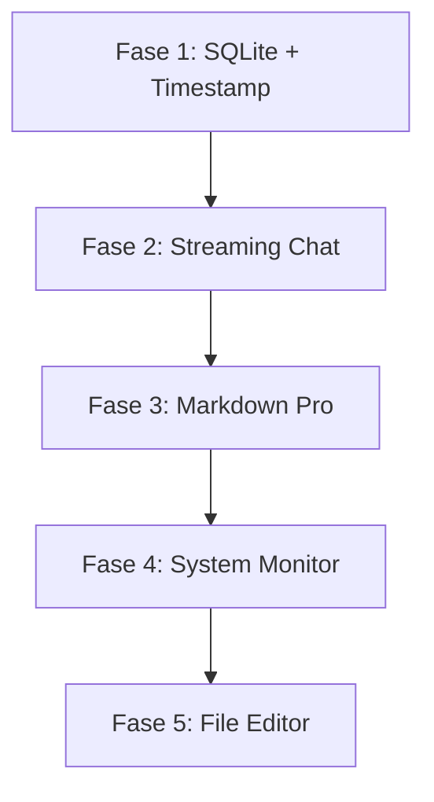

# Neko-Claw v2: Perbaikan Bug & Fitur Baru

Rencana komprehensif untuk memperbaiki bug, migrasi ke SQLite, menambahkan streaming chat, rendering markdown modern, monitoring sistem, dan file editor.

---

## User Review Required

> [!IMPORTANT]
> **Migrasi SQLite**: Semua data yang tersimpan di file JSON (`chat_history.json`, `memories.json`, `souls.json`, `settings.json`) akan dimigrasikan ke satu file database SQLite (`data/neko.db`). File JSON lama akan tetap dipertahankan sebagai backup, tidak dihapus.

> [!WARNING]
> **Dependency Baru (Go)**: Migrasi ke SQLite memerlukan package `modernc.org/sqlite` (pure Go, tanpa CGO). Ini memungkinkan build yang mudah di Windows tanpa perlu compiler C.

> [!WARNING]
> **Dependency Baru (UI)**: Frontend akan menambahkan `react-markdown`, `remark-gfm`, `rehype-highlight`, dan `@monaco-editor/react` (untuk file editor).

---

## Fase 1: Pondasi — Migrasi SQLite & Perbaikan Timestamp

### 1.1 Backend: Migrasi Database ke SQLite

#### [NEW] [database.go](file:///d:/Websites/neko-claw/agent/database.go)
File baru yang menangani seluruh interaksi database:
- `initDatabase()` — Membuat/membuka file `data/neko.db`, membuat tabel jika belum ada.
- Schema tabel:
  ```sql
  -- Settings (key-value pairs)
  CREATE TABLE IF NOT EXISTS settings (
    key TEXT PRIMARY KEY,
    value TEXT NOT NULL
  );

  -- Chat sessions
  CREATE TABLE IF NOT EXISTS chat_sessions (
    id TEXT PRIMARY KEY,
    title TEXT NOT NULL,
    archived INTEGER DEFAULT 0,
    created_at DATETIME DEFAULT CURRENT_TIMESTAMP,
    updated_at DATETIME DEFAULT CURRENT_TIMESTAMP
  );

  -- Chat messages (with per-message timestamps!)
  CREATE TABLE IF NOT EXISTS chat_messages (
    id INTEGER PRIMARY KEY AUTOINCREMENT,
    session_id TEXT NOT NULL,
    role TEXT NOT NULL,
    content TEXT NOT NULL,
    created_at DATETIME DEFAULT CURRENT_TIMESTAMP,
    FOREIGN KEY (session_id) REFERENCES chat_sessions(id) ON DELETE CASCADE
  );

  -- Memories
  CREATE TABLE IF NOT EXISTS memories (
    id TEXT PRIMARY KEY,
    content TEXT NOT NULL,
    category TEXT NOT NULL,
    priority INTEGER DEFAULT 3,
    tags TEXT DEFAULT '',  -- JSON array stored as text
    created_at DATETIME DEFAULT CURRENT_TIMESTAMP,
    last_used DATETIME DEFAULT CURRENT_TIMESTAMP
  );

  -- Souls (custom souls only, defaults stay in code)
  CREATE TABLE IF NOT EXISTS souls (
    id TEXT PRIMARY KEY,
    name TEXT NOT NULL,
    description TEXT,
    system_prompt TEXT NOT NULL,
    emoji TEXT NOT NULL,
    color TEXT NOT NULL
  );

  CREATE TABLE IF NOT EXISTS active_config (
    key TEXT PRIMARY KEY,
    value TEXT NOT NULL
  );
  ```
- `migrateFromJSON()` — Fungsi one-time yang membaca file JSON lama dan mengimpornya ke SQLite. Menandai migrasi selesai via tabel `active_config`.

#### [MODIFY] [chat_history.go](file:///d:/Websites/neko-claw/agent/chat_history.go)
- Tambahkan field `CreatedAt time.Time` pada struct `ChatMessage`.
- Refaktor semua metode `ChatHistoryStore` untuk menggunakan SQLite query, menggantikan in-memory slice + JSON file.
- `AddMessage` sekarang menyimpan `created_at` per pesan secara otomatis.
- `GetSession` mengembalikan pesan lengkap beserta timestamp masing-masing.

#### [MODIFY] [memory.go](file:///d:/Websites/neko-claw/agent/memory.go)
- Refaktor `MemoryStore` untuk menggunakan SQLite.
- `SearchMemories` sekarang menggunakan `LIKE` query SQL (lebih efisien dari iterasi slice).
- Sorting berdasarkan priority dilakukan di level SQL (`ORDER BY priority DESC`).

#### [MODIFY] [soul.go](file:///d:/Websites/neko-claw/agent/soul.go)
- Active soul disimpan di tabel `active_config`.
- Custom souls (jika ada di masa depan) disimpan di tabel `souls`.
- Default souls tetap di-hardcode di Go.

#### [MODIFY] [main.go](file:///d:/Websites/neko-claw/agent/main.go)
- Ganti `loadSettings()` → baca dari SQLite.
- `saveSettings()` → simpan ke SQLite.
- Panggil `initDatabase()` + `migrateFromJSON()` saat startup, sebelum init stores.

#### [MODIFY] [go.mod](file:///d:/Websites/neko-claw/agent/go.mod)
- Tambah dependency: `modernc.org/sqlite`.

---

### 1.2 Frontend: Perbaikan Timestamp Pesan

#### [MODIFY] [api.ts](file:///d:/Websites/neko-claw/ui/src/lib/api.ts)
- Update interface `ChatSessionFull.messages` untuk menyertakan `createdAt: string` per pesan.
  ```typescript
  export interface ChatSessionFull {
    id: string;
    title: string;
    messages: { role: string; content: string; createdAt: string }[];
    // ...
  }
  ```

#### [MODIFY] [page.tsx](file:///d:/Websites/neko-claw/ui/src/app/page.tsx)
- Perbaiki `selectSession` agar menggunakan `m.createdAt` untuk timestamp setiap pesan, bukan `session.updatedAt`:
  ```diff
  - timestamp: new Date(session.updatedAt),
  + timestamp: new Date(m.createdAt),
  ```

---

## Fase 2: Streaming Chat (SSE)

### 2.1 Backend: Endpoint Streaming

#### [MODIFY] [llm.go](file:///d:/Websites/neko-claw/agent/llm.go)
- Tambah handler baru `handleChatStream` yang menggunakan `CreateChatCompletionStream`.
- Implementasi Server-Sent Events (SSE):
  ```
  Content-Type: text/event-stream
  
  data: {"type":"token","content":"Hello"}
  data: {"type":"token","content":" world"}
  data: {"type":"tool_call","command":"...","description":"...","id":"..."}
  data: {"type":"done","sessionId":"...","activeSoul":"...","soulEmoji":"...","memoryCount":5}
  ```
- Respond fallback juga dipertahankan (endpoint `/api/chat` lama tetap berfungsi untuk backward-compatibility).

#### [MODIFY] [main.go](file:///d:/Websites/neko-claw/agent/main.go)
- Daftarkan route baru: `POST /api/chat/stream`.

### 2.2 Frontend: Konsumsi Stream

#### [MODIFY] [api.ts](file:///d:/Websites/neko-claw/ui/src/lib/api.ts)
- Tambah fungsi `streamChatMessage()` menggunakan `fetch` + `ReadableStream`.
- Callback-based: `onToken(text)`, `onToolCall(cmd)`, `onDone(meta)`.

#### [MODIFY] [page.tsx](file:///d:/Websites/neko-claw/ui/src/app/page.tsx)
- Update `sendMessage` untuk menggunakan stream:
  - Buat bubble AI kosong terlebih dahulu.
  - Append token-demi-token ke dalam bubble tersebut.
  - Tampilkan efek "typing" yang natural.
- Fallback ke non-stream jika stream gagal.

---

## Fase 3: Rendering Markdown Modern

### 3.1 Dependencies

#### [MODIFY] [package.json](file:///d:/Websites/neko-claw/ui/package.json)
- Tambahkan:
  - `react-markdown` — Parsing dan rendering markdown.
  - `remark-gfm` — Dukungan GitHub Flavored Markdown (tabel, strikethrough, checklist).
  - `rehype-highlight` — Syntax highlighting untuk blok kode.
  - `highlight.js` — Library syntax highlighting.

### 3.2 Komponen Markdown

#### [NEW] [Markdown.tsx](file:///d:/Websites/neko-claw/ui/src/components/Markdown.tsx)
Komponen React baru menggantikan fungsi `renderMarkdown()` regex:
- Menggunakan `ReactMarkdown` dengan `remark-gfm` dan `rehype-highlight`.
- Custom renderer untuk blok kode: tombol "Copy to Clipboard" dan label bahasa.
- Menangani tabel, checklist, link, gambar secara proper.

#### [MODIFY] [page.tsx](file:///d:/Websites/neko-claw/ui/src/app/page.tsx)
- Hapus fungsi `renderMarkdown()`.
- Ganti `dangerouslySetInnerHTML` pada `MessageBubble` AI dengan komponen `<Markdown>`.

#### [MODIFY] [globals.css](file:///d:/Websites/neko-claw/ui/src/app/globals.css)
- Tambahkan styling untuk `highlight.js` theme yang sesuai (dark theme, warna amber/gold).
- Tambahkan styling untuk tabel markdown (border, padding, zebra-stripe).

---

## Fase 4: System Monitoring & Context

### 4.1 Backend: System Info

#### [MODIFY] [util.go](file:///d:/Websites/neko-claw/agent/util.go)
Tambahkan fungsi-fungsi berikut:
- `getSystemInfo() SystemInfo` — Mengambil info OS, hostname, username, current directory.
- `getResourceUsage() ResourceUsage` — Mengambil CPU %, RAM usage/total, disk space. Menggunakan perintah PowerShell sederhana seperti `Get-CimInstance`.

#### [NEW] Endpoint: `GET /api/system/info`
- Mengembalikan JSON berisi info sistem dan resource usage.
- Digunakan oleh frontend untuk status bar dan oleh LLM untuk konteks.

#### [MODIFY] [llm.go](file:///d:/Websites/neko-claw/agent/llm.go)
- Injeksi ringkasan system info ke dalam system prompt:
  ```
  [System Context]
  OS: Windows 11 (22H2)
  User: plhr9
  CWD: D:\Projects
  CPU: 35%, RAM: 8.2/16 GB (51%), Disk C:: 120/256 GB free
  ```

### 4.2 Frontend: Status Bar Sistem

#### [MODIFY] [page.tsx](file:///d:/Websites/neko-claw/ui/src/app/page.tsx)
- Tambahkan widget kecil di status bar yang menampilkan CPU %, RAM %, dan hostname.
- Polling setiap 10 detik dari `/api/system/info`.
- Tampilkan sebagai indicator bar mini (mirip progress bar tipis berubah warna sesuai beban).

---

## Fase 5: File Editor

### 5.1 Backend: File System API

#### [NEW] [filesystem.go](file:///d:/Websites/neko-claw/agent/filesystem.go)
File baru untuk semua operasi filesystem:
- `GET /api/files?path=<dir>` — List isi direktori (nama, tipe, ukuran, last modified).
- `GET /api/files/read?path=<file>` — Baca isi file (text only, max 1MB).
- `POST /api/files/write` — Tulis/simpan file (body: `{path, content}`).
- `POST /api/files/mkdir` — Buat direktori baru.
- `DELETE /api/files?path=<file>` — Hapus file/folder.

> [!CAUTION]
> **Keamanan**: Semua operasi file akan dibatasi hanya ke direktori yang diizinkan (configurable via settings). Default: direktori home user. Path traversal (`../`) akan diblokir.

#### [MODIFY] [main.go](file:///d:/Websites/neko-claw/agent/main.go)
- Daftarkan route-route baru: `/api/files`, `/api/files/read`, `/api/files/write`, `/api/files/mkdir`.

### 5.2 Frontend: File Explorer & Editor

#### [MODIFY] [package.json](file:///d:/Websites/neko-claw/ui/package.json)
- Tambahkan `@monaco-editor/react` — Editor kode profesional (VS Code engine).

#### [NEW] [files/page.tsx](file:///d:/Websites/neko-claw/ui/src/app/files/page.tsx)
Halaman baru `/files` dengan dua panel:
- **Panel Kiri**: Tree view/list view navigasi folder. Klik-klik untuk menjelajah.
- **Panel Kanan**: Monaco Editor yang menampilkan isi file yang dipilih.
  - Syntax highlighting otomatis berdasarkan ekstensi file.
  - Tombol **Save** (Ctrl+S) untuk menyimpan perubahan.
  - Tombol **New File** dan **New Folder** di toolbar.
  - Indikator "unsaved changes" (dot/warna).

#### [MODIFY] [layout.tsx](file:///d:/Websites/neko-claw/ui/src/app/layout.tsx)
- Tambahkan link navigasi baru: `📂 Files` yang menuju ke `/files`.

#### [MODIFY] [api.ts](file:///d:/Websites/neko-claw/ui/src/lib/api.ts)
- Tambahkan fungsi-fungsi client:
  ```typescript
  listFiles(path: string): Promise<FileEntry[]>
  readFile(path: string): Promise<string>
  writeFile(path: string, content: string): Promise<void>
  createDirectory(path: string): Promise<void>
  deleteFile(path: string): Promise<void>
  ```

---

## Ringkasan File yang Berubah

| File | Aksi | Deskripsi |
|------|------|-----------|
| `agent/database.go` | **NEW** | SQLite init, schema, migrasi dari JSON |
| `agent/filesystem.go` | **NEW** | API file explorer & editor |
| `agent/chat_history.go` | MODIFY | Refaktor ke SQLite + timestamp per pesan |
| `agent/memory.go` | MODIFY | Refaktor ke SQLite |
| `agent/soul.go` | MODIFY | Refaktor ke SQLite |
| `agent/main.go` | MODIFY | Route baru, init database |
| `agent/llm.go` | MODIFY | Streaming SSE + system context injection |
| `agent/util.go` | MODIFY | System info functions |
| `agent/go.mod` | MODIFY | Tambah `modernc.org/sqlite` |
| `ui/src/components/Markdown.tsx` | **NEW** | Komponen rendering markdown pro |
| `ui/src/app/files/page.tsx` | **NEW** | Halaman file explorer + editor |
| `ui/src/app/page.tsx` | MODIFY | Streaming, fix timestamp, system widget |
| `ui/src/app/layout.tsx` | MODIFY | Tambah link navigasi "Files" |
| `ui/src/app/globals.css` | MODIFY | Styling markdown + highlight.js |
| `ui/src/lib/api.ts` | MODIFY | Fungsi stream, file API, updated types |
| `ui/package.json` | MODIFY | Dependencies baru |

---

## Urutan Eksekusi



Setiap fase diakhiri dengan verifikasi sebelum lanjut ke fase berikutnya.

---

## Verification Plan

### Automated Tests
1. **SQLite Migration**: Buat file JSON dummy → jalankan migration → verifikasi data di SQLite via query.
2. **Go Build**: `cd agent && go build .` harus sukses tanpa error setelah setiap fase.
3. **UI Build**: `cd ui && npm run build` harus sukses tanpa error TypeScript.

### Manual Verification
1. **Fase 1**: Buka sesi chat lama → pastikan timestamp setiap pesan sudah benar dan berbeda-beda.
2. **Fase 2**: Kirim pertanyaan panjang → lihat teks mengalir kata-demi-kata di bubble AI.
3. **Fase 3**: Kirim pesan berisi kode program dan tabel → verifikasi tampilan premium dengan syntax highlighting.
4. **Fase 4**: Lihat widget CPU/RAM di status bar → pastikan angka berubah secara real-time.
5. **Fase 5**: Buka halaman `/files` → navigasi folder → buka file → edit dan simpan → verifikasi perubahan tersimpan.
